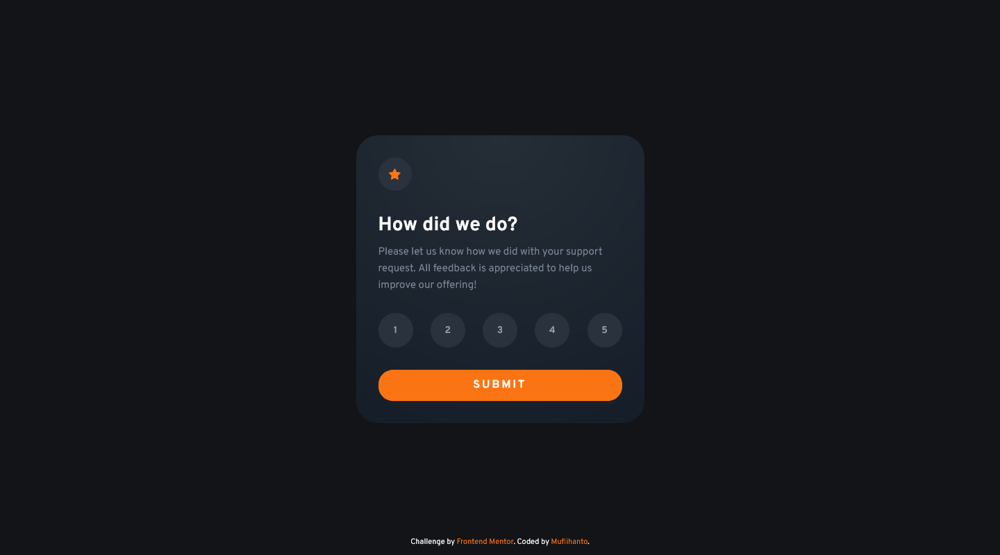
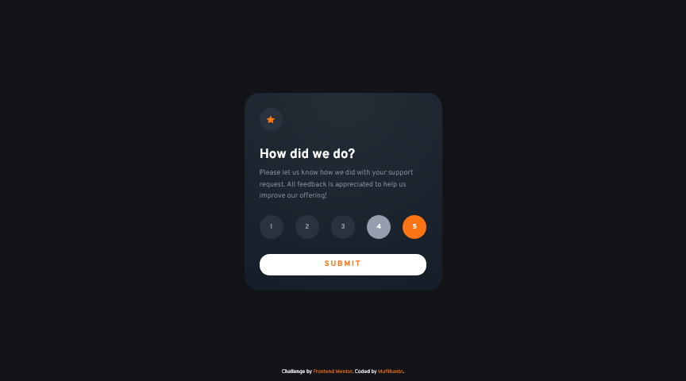

# Frontend Mentor - Interactive rating component solution

This is a solution to the [Interactive rating component challenge on Frontend Mentor](https://www.frontendmentor.io/challenges/interactive-rating-component-koxpeBUmI). Frontend Mentor challenges help you improve your coding skills by building realistic projects. 

## Table of contents

- [Frontend Mentor - Interactive rating component solution](#frontend-mentor---interactive-rating-component-solution)
  - [Table of contents](#table-of-contents)
  - [Overview](#overview)
    - [The challenge](#the-challenge)
    - [Screenshot](#screenshot)
    - [Links](#links)
  - [My process](#my-process)
    - [Built with](#built-with)
    - [What I learned](#what-i-learned)
    - [Useful resources](#useful-resources)
  - [Author](#author)

## Overview

### The challenge

Users should be able to:

- View the optimal layout for the app depending on their device's screen size
- See hover states for all interactive elements on the page
- Select and submit a number rating
- See the "Thank you" card state after submitting a rating

### Screenshot





### Links

- Solution URL: [Github](https://github.com/muflihanto/frontendmentor-interactive-rating-component)
- Live Site URL: [Github Pages](https://muflihanto.github.io/frontendmentor-interactive-rating-component/)

## My process

### Built with

- Semantic HTML5 markup
- CSS custom properties
- Flexbox
- Vanilla JavaScript

### What I learned

```js
if (!rating?.value) {
  // ...
}
```

### Useful resources

- [Optional chaining (?.)](https://developer.mozilla.org/en-US/docs/Web/JavaScript/Reference/Operators/Optional_chaining) - enables you to read the value of a property located deep within a chain of connected objects without having to check that each reference in the chain is valid. 

## Author

- Github - [Muflihanto](https://github.com/muflihanto)
- Frontend Mentor - [@muflihanto](https://www.frontendmentor.io/profile/muflihanto)
- Twitter - [@muflihanto](https://www.twitter.com/muflihanto)